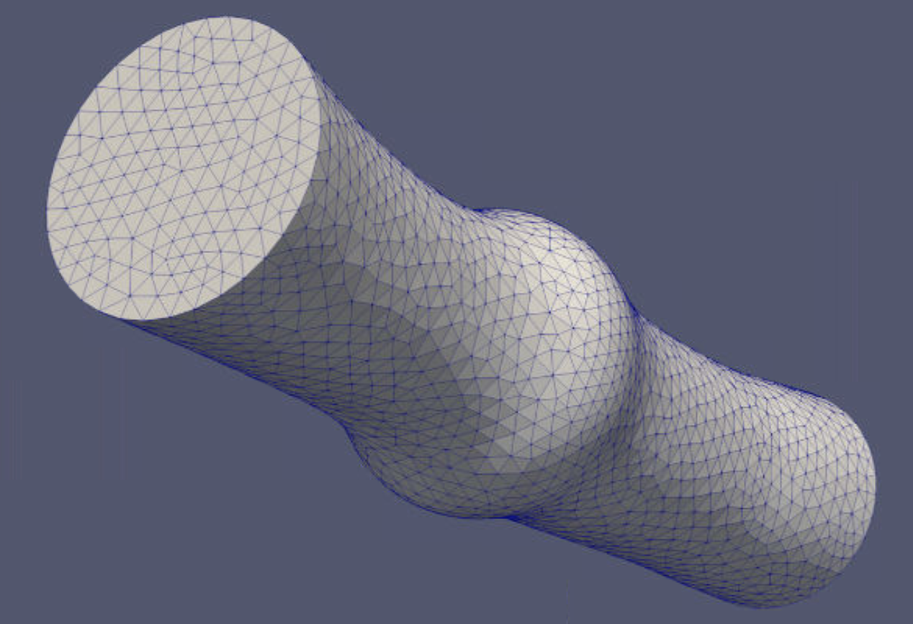
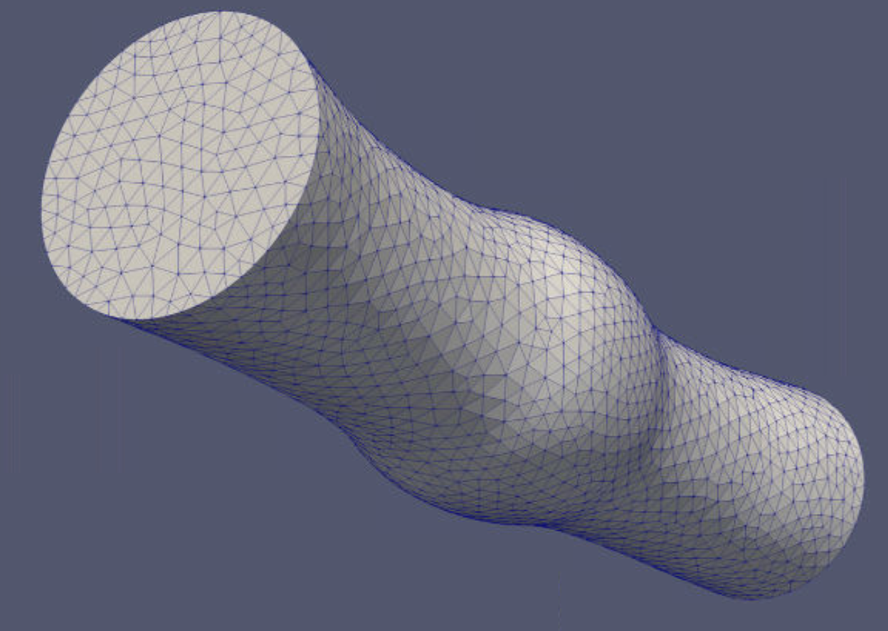
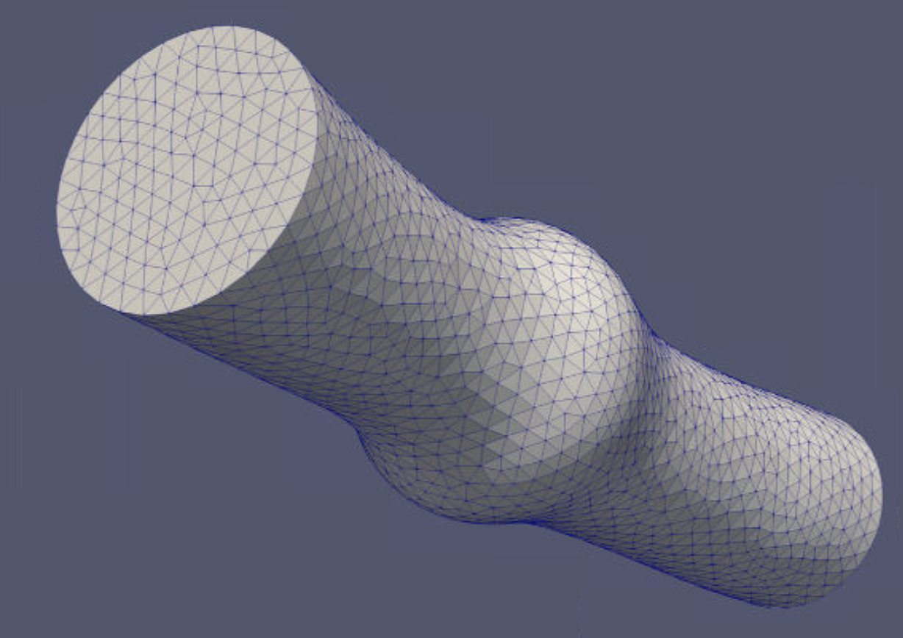
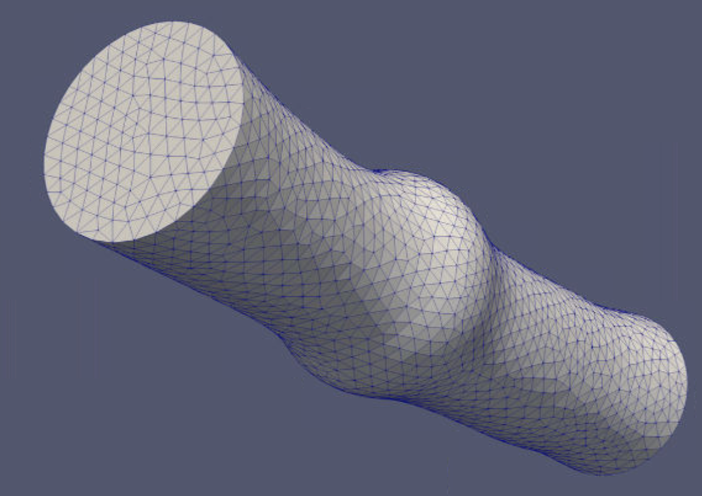
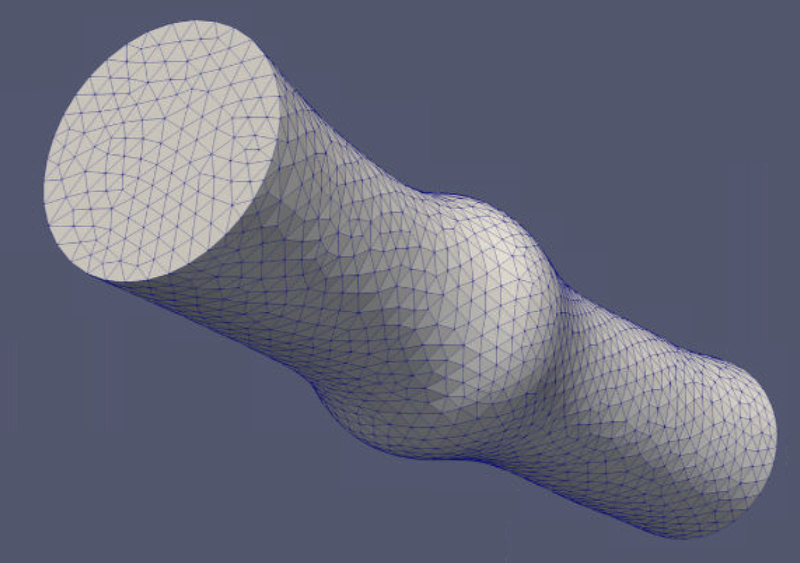
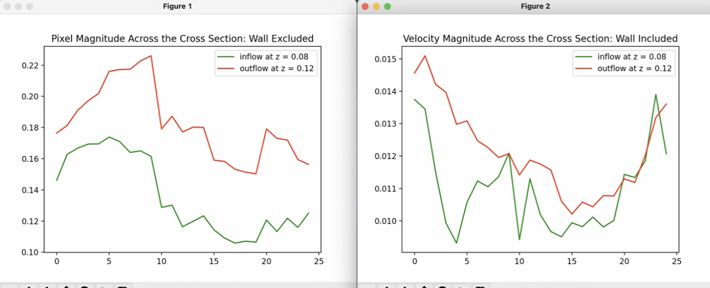

# 4D Flow MRI Flow Assessment
The goal of this project is to post process the 4D Flow MRI image files of the 3D printed tricuspid valve of the aorta to extract the Pixel Magnitude and Velocity Magnitude of the inflow and outflow of the valve. This file consists of the following sections:

- [Dataset](#dataset)
- [Segmentation](#segmentation)
- [Data Projection](#data-projection)
- [Results](#results)

## Dataset
The dataset was shared with our group from the collabolator at UofT and Sickkids hospital of Toronto. The [paper](paper.pdf) is published on 3D Printing in Medicin 2020. The dataset consists of the Dicom files of **4D flow MRI** of a 3D printed valve. The visualization and quantitaive analysis of the MR data were done and data were written into 25 files in VTK format. The goal of this project is to extract the pixel magnitude and flow of the VTK file along the time steps to validate the quantitative processing step.

<p align="center">
    
</p>

## Segmentation and Meshing
The first step of the post processing is to segment and mesh the VTK data. The 3D printed vessel has flexible walls, as a result the geometry is different for each image. Because the changes in between consecutive images are negligble, the dataset of 25 images was devided into 5 subsets and a segmentation was assigned to each subset on SimVascular software. A mesh were also generated based on the segmentation for each subset. The global mesh edge step was set to 0.003 on SimVascular according to the size of the vessel. The vessel is along the z axis.

<p align="center">
1  2 
</p>
<p align="center">
3  4 
</p>
<p align="center">
5 
</p>

## Data Projection
The next step is to project the pixel magnitude scalar value and the velocity array on each point of the mesh. To that end a [script](src/ConvertvtkToVTI.py) is provided to convert all of the VTK images into vti format. To run this script use the following command line:

```bash
$ python src/ConvertvtkToVTI.py -InputFolder /path/to/the/vtk/image/folder
```

The [ProjectImageToMesh](src/ProjectImageToMesh.py) script uses the `vtkProbeFilter` to project the scalar and vector values to the mesh points. The [AutomateProjection](src/AutomateProjection.py) script uses the previous script and does the projection automatically given tow input folders containing vti images and vtu meshes, so there is no need to run the code image by image. To run this script use the following command:

```bash
$ python src/AutomateProjection -InputImageFolder /path/to/the/vti/image/folder -InputMeshFolder /path/to/the/vtu/mesh/folder
```

<p align="center">
    
</p>

## Results
Finally to acquire the pixel and velocity magnitude results [InputOutputFlow](src/InputOutputFlow.py) script is used. In this script, two cross sections one in the inflow and the other one in the outflow were selected the same as the sections selected on the [paper](paper.pdf). Next, to exclude the effect of the wall a `vtkSphere` filter was set into the cross section to only take 80% of the inner circle of the cross section. Finally, the average value of the pixel value and velocity vector magnitude across the cross section is calculated. Using a loop over volumetric geometeries to take the inflow and outflow averaged values. The results are provided below:

<p align="center">
    
</p>